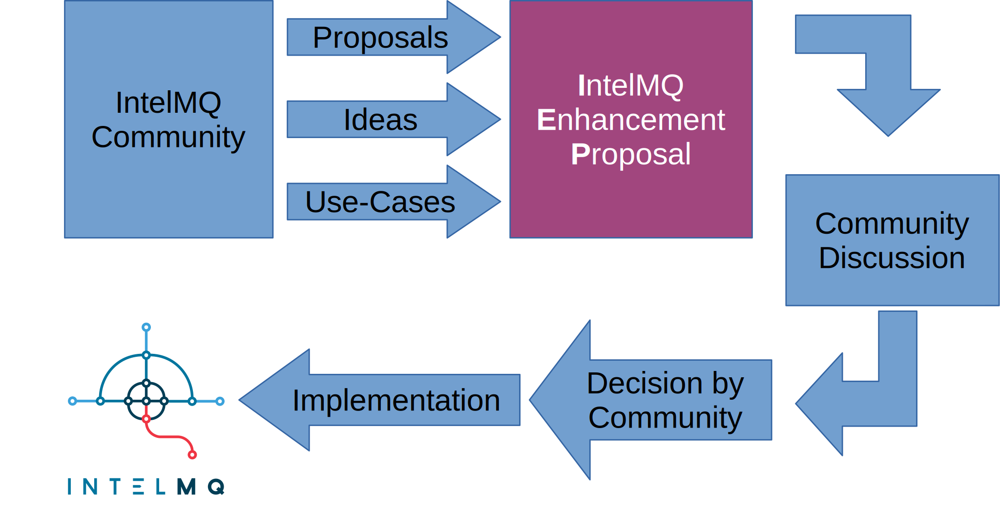

# IntelMQ Enhancement Proposals

This repository is for collaboratively creating IntelMQ Enhancement Proposals.
IEPs are needed for major and/or architectural changes in IntelMQ.
The IEPs should be discussion on the [intelmq-dev Mailinglist](https://lists.cert.at/cgi-bin/mailman/listinfo/intelmq-dev).

## Process

## List of IEPs

| #   | Name                                                                   | Status                                                                                     | Target release |
| --- | ---------------------------------------------------------------------- | ------------------------------------------------------------------------------------------ | -------------- |
| 001 | [Configuration Handling](001/)                                         | [Implementation completed](https://github.com/certtools/intelmq/projects/9)                | 3.0.0          |
| 002 | [Mixins](002/)                                                         | [Implementation completed](https://github.com/certtools/intelmq/projects/10)               | 3.0.0          |
| 003 | [Internal Data Format: Multiple Values](003/)                          | Dismissed                                                                                  | 3.0.0          |
| 004 | [Internal Data Format: Meta Information and Data Exchange](004/)       | Implementation waiting. Decided and formalized via a [JSON Schema](004/schema/schema.json) | 3.x.0 or 4.0.0 |
| 005 | [Internal Data Format: Notification settings](005/)                    | Undiscussed                                                                                | 3.x.0 or 4.0.0 |
| 006 | [Internal Data Format: Msgpack as serializer](006/)                    | Undiscussed                                                                                | 3.x.0 or 4.0.0 |
| 007 | [Running IntelMQ as Python Library](007/)                              | [Implementation completed](https://github.com/certtools/intelmq/blob/3.2.0/NEWS.md)        | 3.2.0          |
| 008 | [IntelMQ Data Format: Constituency field](008/)                        | Discussion in progress                                                                     | 3.x.0          |
| 009 | [IntelMQ Data Format: Describe product and mark vulnerabilities](009/) | Discussion in progress                                                                     | 3.x.0          |
| 010 | [Shadowserver schema update](010/)                                     | [Implementation completed](https://github.com/certtools/intelmq/pull/2372)                 | 3.3.0          |

### Status legend
* Undiscussed: The IEP was not yet discussed and/or is not yet finished
* Discussion in progress: Community did not yet decided
* Implementation waiting: IEP was approved by the community, the implementation is waiting
* Implementation in progress: IEP was approved by the community, the implementation is in progress
* Implementation completed: IEP was approved by the community, the implementation is completed
* Dismissed: IEP was not approved by the community
